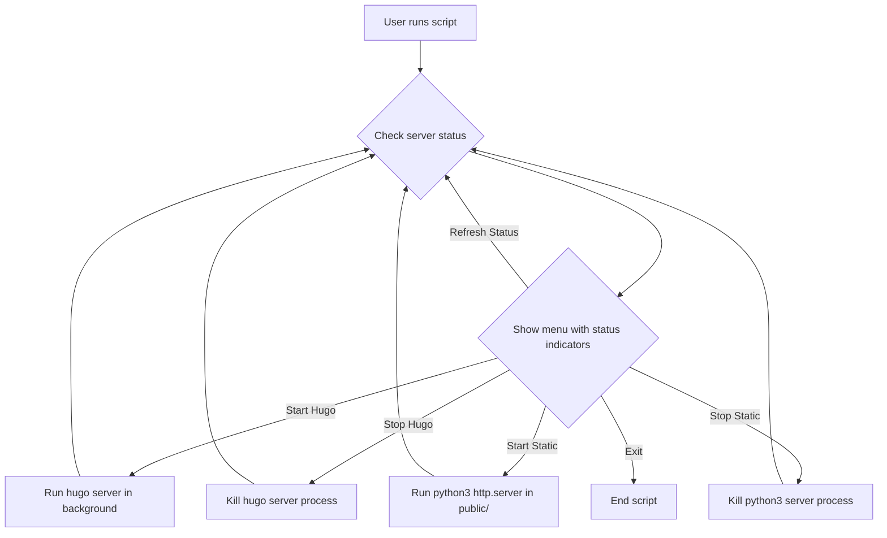

# Interactive CLI Menu with Real-Time Server Status Indicators

## Overview

This script provides a user-friendly, interactive menu in the terminal using `dialog` or `whiptail`. It allows you to:

- Start/stop the Hugo development server
- Start/stop a static output server (Python HTTP server in `public/`)
- See a real-time, color-coded status indicator for each server (green = running, red = stopped)
- Check the status of both servers at a glance
- Exit the menu

## Real-Time Status Indicator

- The menu displays a prominent green icon (🟢) when a server is running and a red icon (🔴) when it is not.
- The status is checked and updated every time the menu is shown, so you always see the current state.
- The indicator appears next to each server option in the menu.

## Example Menu (as seen in your terminal)

```
┌────────────────────────────────────────────┐
│         Server Control Menu                │
├────────────────────────────────────────────┤
│ Hugo Server:         🟢 Running            │
│ Static Output:       🔴 Stopped            │
│                                            │
│  1. Start Hugo Server                      │
│  2. Stop Hugo Server                       │
│  3. Start Static Output Server             │
│  4. Stop Static Output Server              │
│  5. Refresh Status                         │
│  6. Exit                                   │
└────────────────────────────────────────────┘
```
- The icons update in real time as you start/stop servers.

## How the Script Works

1. **Menu Display:** When you run the script, a menu appears with options for server control and real-time status indicators.
2. **Status Check:** Before showing the menu, the script checks if each server is running and sets the icon color accordingly.
3. **Action Selection:** Use arrow keys and Enter to select an action.
4. **Server Control:** The script starts/stops the appropriate server in the background, or checks their status.
5. **Feedback:** Each action shows a confirmation or error dialog.
6. **Loop:** After each action, the menu reappears with updated status until you choose Exit.

## Visual Plan



## Benefits

- Instantly see which servers are running with clear, color-coded icons.
- No need to remember commands—just use the menu.
- Prevents mistakes (like running two servers on the same port).
- Easy to use for anyone, even if they’re not comfortable with the CLI.

---

**Next step:** Confirm you’re happy with this revised plan, or suggest changes. Once approved, I’ll switch to code mode and implement the script in `my-landing-page/`.